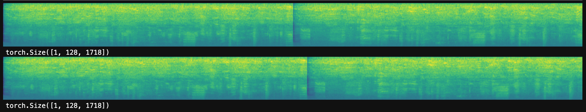
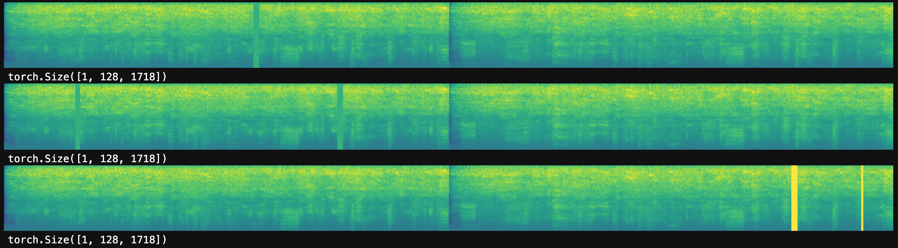
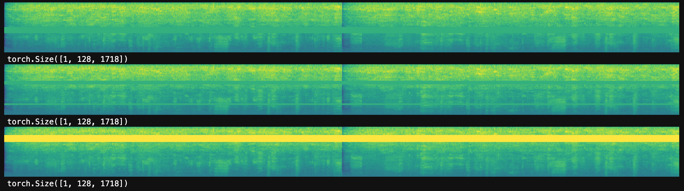
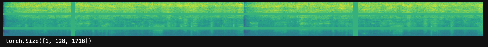

# SpecAugment with Pytorch
## A Pytorch Implementation of GoogleBrain's SpecAugment: A Simple Data Augmentation Method for Automatic Speech Recognition
[Medium Article](https://towardsdatascience.com/sota-data-augmentation-with-google-brains-specaugment-and-pytorch-d3d1a3ce291e)

[SpecAugment](https://ai.googleblog.com/2019/04/specaugment-new-data-augmentation.html) is a state of the art data augmentation approach for speech recognition.

The paper's authors did not publish code that I could find and their implementation was in TensorFlow. We implemented all three SpecAugment transforms using Pytorch, torchaudio, and [fastai](https://fast.ai) / [fastai-audio](https://github.com/zcaceres/fastai-audio).

## To use:
1. Run `install.sh` (I recommend using a unique `conda` env for the project)

After the install script runs, you should have a `torchaudio` folder in your project folder.

2. Check out SpecAugment.ipynb (a Jupyter notebook) for the functions.

### Augmentations
Time Warp

Time Mask

Frequency Mask

Combined:

### Note on Time Warp
The Time Warp augmentation relies on Tensorflow-specific functionality not supported in Pytorch. We implemented supporting functions for this augmentation in `SparseImageWarp.ipynb`. You do not need to look at this notebook to use the augmentations. But the Time Warp augmentation depends on code exposed in the `SparseImageWarp` notebook.

Let's be friends!
- [@zachcaceres](https://twitter.com/zachcaceres)
- [zach.dev](https://zach.dev)
